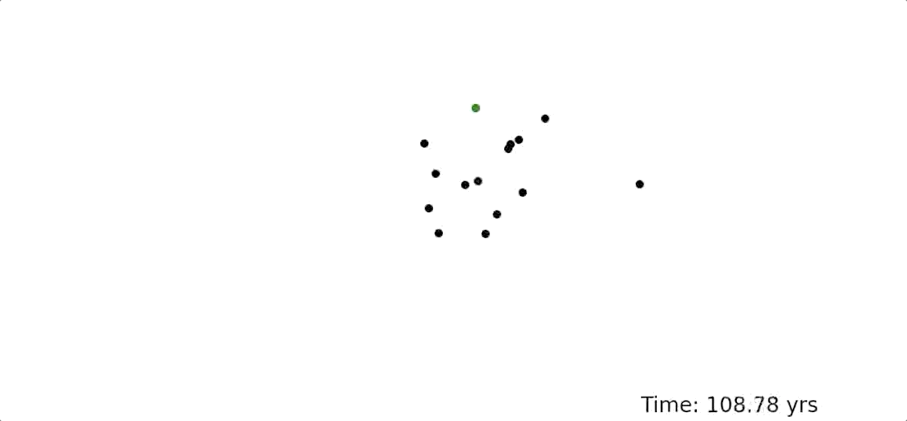

**nesslite**

nesslite is a rudimentary leapfrog N-body code that I, Ben Learn, created in the spring of 2019. nesslite simulates a system that includes the Sun, the gas giant planets (excluding Jupiter), large Kuiper Belt Objects, and a theoretical Planet Nine in order to observe the effect of Planet Nine on the solar system. Planet Nine in this version of nesslite is a 0.3 Earth mass body with a semi-major axis of 75 AU. The initial positions for each object are its positions on May 1, 2019 and the initial velocities of eachobject are its velocities on November 10, 2017, 537 days (1/2 of the 2.94 yr timestep) before May 1, 2019; this information was retrieved from JPL's HORIZONS Web-Interface. The algorithm is far from perfect; in particular, it has lots of trouble conserving angular momentum. I plan on fixing this and other issues in future commits.

**File List and Run Commands**

nesslite source files:  
src/leapfrog.c  
src/nesslite.c  
src/particle_struct.c  
src/nesslite.h  
src/Makefile  

Run by:  
make  
./nesslite (must be in build directory)

Files for analyzing nesslite simulations:  
src/plotter.py *(produces pictures of every 1,000 timesteps of the simulation in output/snapshots/)*  
src/conservation.py *(calculates initial, final, and fractional difference for total energy and total angular momentum for the simulation)*
src/np_plotter.py *(same as plotter.py but with numpy usage)*
src/np_conservation.py *(same as conservation.py but with numpy usage)*

Run by:  
python3.6 plotter.py *Note: must have matplotlib installed.*  
python3.6 conservation.py
python3.6 np_plotter.py *Note: must have numpy and matplotlib installed.*
python3.6 np_conservation.py *Note: must have numpy installed.*

Commands to make videos of nesslite simulation screenshots:  
ffmpeg -r 60 -f image2 -s 1920x1080 -i snapshots/snapshot\_%04d.png -pix\_fmt yuv420p simulation.mp4

*Note: Must have ffmpeg installed; command given is to be run in output directory.*

**Movie Example**  
An example of a short movie from a nesslite simulation is shown below (Planet Nine is the green dot).

